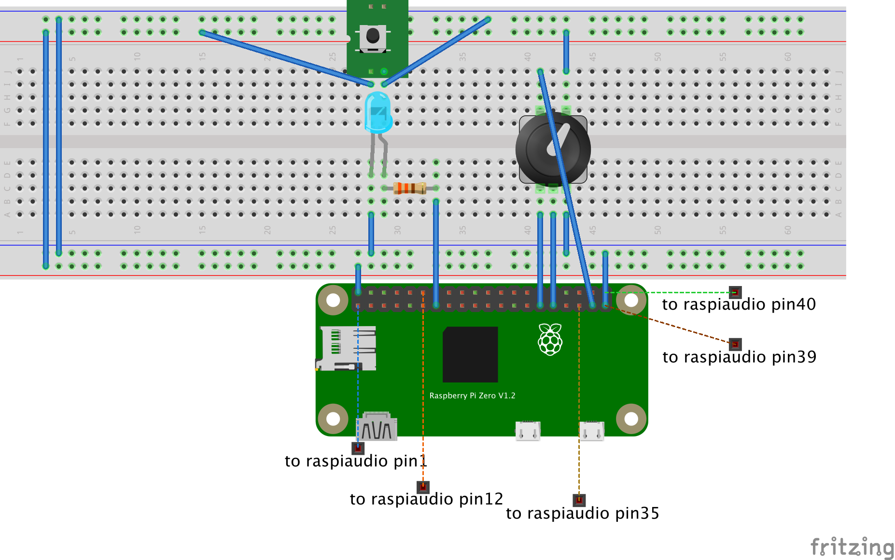
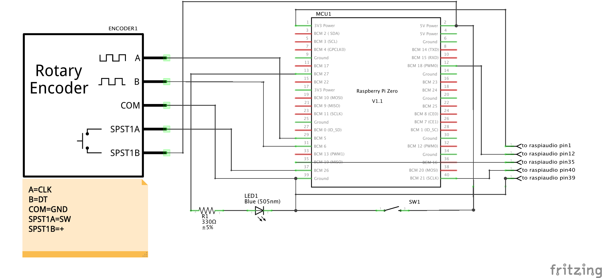

Lecteur de souvenir
===================
Un montage électronique pour lire de manière aléatoire des fichiers sonores pré-enregistrés au format mp3.
Un cadeau idéal pour les grands-parents à Noël (avec les voix des petits enfants racontant leurs meilleurs souvenirs).

Conçu autour :

* d'un Raspberry Pi Zero W,
* d'une [carte son pour Raspberry Pi Zero](http://amzn.eu/d/8MlHNYm),
* d'un [potentiomètre numérique](http://amzn.eu/d/aPnkfWV) (rotary encoder) pour lancer la lecture et modifier le volume,
* de divers [boutons, résistances et leds](http://amzn.eu/d/18uhg3K) pour allumer/éteindre le lecteur et indiquer l'état d'activité.

Configuration
-------------
Dans le fichier [memory_player.py](files/memories_player.py), certains paramètres en début de fichier peuvent être modifiés :

* ```GPIO_A``` et ```GPIO_B``` sont les broches du raspberry connectées aux entrées CLK et DT du potentiomètre numérique
* ```GPIO_BUTTON``` est la broche du Raspberry connectée à l'entrée SW du potentiomètre numérique
* ```GPIO_LED``` est la broche du Raspberry connectée à la led indicatrice d'état
* ```GPIO_SHUTDOWN``` est la broche du Raspberry connectée au bouton d'arrêt/de mise en service
* ```VOLUME_SAVEFILE``` est le chemin vers le fichier permettant de sauvegarder le niveau du volume lors de l'arrêt du système


Installation initiale
---------------------
Mettez à jour l'[inventaire Ansible](inventory) avec l'IP/le nom du raspberry sur le réseau, puis lancez :
```ansible-playbook -i inventory setup.yml```

Utilisation
-----------
Allumez/éteignez le Raspberry avec le bouton.

Téléchargez de nouveau souvenirs au format mp3 à l'aide du serveur web intégré.

Appuyez sur le bouton du potentiomètre pour démarrer la lecture d'un souvenir aléatoire.

Tournez le potentiomètre pour modifier le volume.


Ressources
==========
Breadboard
----------


Schéma électronique
--------------------


Boitier principal
-----------------
Ce boitier contient :

* le Raspberry Pi Zero
* la carte audio Raspiaudio

Le [boitier](documentation_resources/boitier_principal.stl) - Le [couvercle](documentation_resources/boitier_principal_couvercle.stl)

Boitier de télécommande filaire
-------------------------------
Il s'agit d'un boitier déporté permettant de contrôler le boitier principal, par exemple lorsque ce dernier est fixé à l'arrière d'un cadre photo et la télécommande filaire sur la tranche du cadre.

Ce boitier contient :

* le potentiomètre numérique
* le bouton de mise sous tension
* la led indicatrice d'état

Le tout, implanté sur une plaque d'essai.

Le [boitier](documentation_resources/boitier_secondaire.stl) - Le [couvercle](documentation_resources/boitier_secondaire_couvercle.stl)


Crédits
=======
Ce projet est un assemblage de plusieurs sources trouvées çi et là sur Internet :

* les drivers Audio proviennent de [raspiaudio.com](https://www.raspiaudio.com)
* le serveur web intégré est [pad.js](https://pad.js.org)
* Le code de gestion du potentiomètre numérique a été adapté des [forums Raspberry](https://www.raspberrypi.org/forums/viewtopic.php?t=140250)

License
=======
[MIT License](LICENSE)